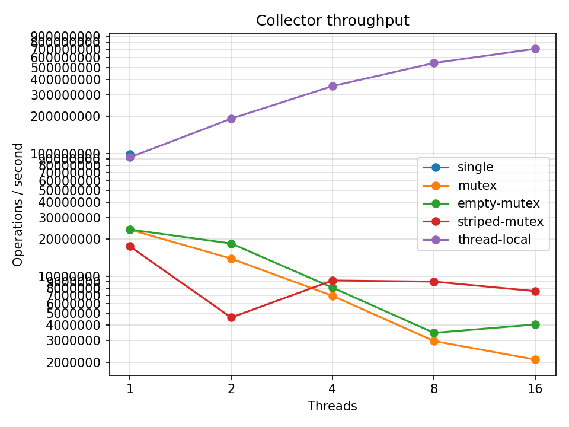

# Лабораторная работа: Коллектор метрик

## О чём эта лаба

Представьте сервис, обрабатывающий десятки тысяч запросов в секунду. На каждый запрос нам нужно засечь время его выполнения (latency) и сохранить метрику. Время от времени мониторинг опрашивает наш сервис: «дай мне текущий снимок метрик: среднее, 99-й перцентиль (p99) и гистограмму».

Кажется просто: завели общие переменные и пишем туда. Но в многопоточке всё мгновенно ломается:
1. Повесили общий лок — потоки выстроились в пробку, пропускная способность рухнула в разы.
2. Раздробили лок на части — пропускная способность не выросла (почему?), а снимок (`snapshot`) стал возвращать битые данные прямо во время работы.
3. Дали каждому потоку свой личный счетчик — запись взлетела, но снимок всё ещё врёт.
4. Сделали двойную буферизацию — получили и честную многопоточную скорость, и согласованный снимок, не блокируя пишущие потоки мьютексом.


В этой работе вы пройдёте весь этот путь своими руками, шаг за шагом, на C++ или Java.

---

## Общие требования

- **Язык на выбор:** C++ (C++20) или Java (JDK 17+).
- **Ограничения по библиотекам (касаются только реализаций коллектора, замерялка может использовать `CountDownLatch` / `std::latch`):**
  - **Java:** запрещены готовые конкурентные коллекции (`ConcurrentHashMap`), `LongAdder`, а также `AtomicReference` на массивы. В коллекторах используем только базовые вещи: `synchronized`, `volatile`, `AtomicLong`, `AtomicInteger`, `AtomicLongArray`, `ThreadLocal`, обычные коллекции (`ArrayList`) строго под локом, `Thread.onSpinWait()`.
  - **C++:** запрещены сторонние библиотеки вроде TBB или Folly. В коллекторах только стандартные примитивы: `std::mutex`, `std::atomic`, `thread_local`, `std::unique_ptr`, обычные контейнеры (`std::vector`) под локом, `std::this_thread::yield()`.

- **Как компилировать и запускать:**
  - **C++:**
    ```bash
    # Основная сборка для всех замеров (с оптимизацией):
    g++ -O2 -std=c++20 -pthread src/*.cpp -o bench

    # Проверка на гонки данных через ThreadSanitizer (TSan):
    # ВНИМАНИЕ: работает в 5-15 раз медленнее! Замеры скорости здесь делать нельзя!
    clang++ -fsanitize=thread -g -O1 -std=c++20 -pthread src/*.cpp -o bench_tsan
    ```
    *Важно:* если запускаете из CLion/VS Code, убедитесь, что бенчмарк запускается в Release-профиле (`-O2`). В Debug-сборке из-за отсутствия оптимизаций эффекты многопоточки могут исказиться до неузнаваемости.
  - **Java:** компилируется стандартным `javac`. Biased locking выключен по умолчанию в JDK 15 (JEP 374) и полностью удалён в JDK 18, так что никаких особых флагов JVM передавать не нужно. TSan в обычной JVM нет, поэтому корректность проверяем стресс-тестами.


---

## Что мы пишем: структура коллектора

Коллектор принимает задержки запросов в миллисекундах (`value` от `0` до `1023`) через метод `record(value)` и хранит:

1. **Гистограмму из 256 корзин (`buckets`):**
   Каждая корзина покрывает диапазон в 4 мс:
   - Корзина 0: `0..3` мс
   - Корзина 1: `4..7` мс
   - ...
   - Корзина 255: `1020..1023` мс (если пришло значение $\ge 1024$, его тоже отправляем в 255-ю).
   
   Формула корзины: `bucket = min(value / 4, 255)`.

2. **Общую сводку (summary):**
   - `count` — сколько всего вызовов `record()` пришло;
   - `sum` — сумма всех значений `value` (чтобы посчитать среднее: `sum / count`);
   - `min` и `max` — минимальное и максимальное значение за всё время.

3. **Снимок (`snapshot()`):**
   Возвращает объект `Snapshot`, содержащий отдельную копию корзин, сводку, а также вычисленные перцентили:
   - `p50` (медиана) — задержка, ниже которой уложились 50% запросов.
   - `p99` — задержка, ниже которой уложились 99% запросов.
   *Оба перцентиля возвращаются в миллисекундах* (нижняя граница соответствующей корзины: `bucket_index * 4`).

### Сигнатуры классов

**Java:**
```java
public record Snapshot(
    long[] buckets, // ровно 256 элементов (глубокая копия, не ссылка!)
    long count,
    long sum,
    long min,
    long max,
    long p50,       // в мс: индекс_корзины * 4
    long p99
) {}

public interface MetricsCollector {
    void record(long value);
    Snapshot snapshot();
}
```

**C++:**
```cpp
#include <array>
#include <cstdint>

struct Snapshot {
    std::array<uint64_t, 256> buckets;
    uint64_t count;
    uint64_t sum;
    uint64_t min;
    uint64_t max;
    uint64_t p50;
    uint64_t p99;
};

class MetricsCollector {
public:
    virtual ~MetricsCollector() = default;
    virtual void record(uint64_t value) = 0;
    virtual Snapshot snapshot() = 0;
};
```

---

## Этапы работы

### Этап 0. Однопоточная база и замерялка

На этом этапе пишем базовый однопоточный класс без синхронизации и честный бенчмарк, которым будем измерять все последующие этапы.

#### 1. Логика `snapshot()` и расчёт перцентилей
Сделайте копию корзин и полей сводки. Затем найдите `p50` и `p99` кумулятивным суммированием по корзинам:

```
Кумулятивный поиск (на примере p99):
  порог = count * 0.99
  накоплено = 0
  для i от 0 до 255:
      накоплено += buckets[i]
      если накоплено >= порог:
          вернуть i * 4   // порог достигнут, возвращаем нижнюю границу корзины (в мс)
```

#### 2. Генератор нагрузки (распределение Ципфа)
В реальной жизни запросы не бывают равномерными: около половины запросов быстрые (0–10 мс), но хвост распределения длинный — каждый пятый запрос длится дольше 100 мс.
- Сгенерируйте массив `values` из $2^{20}$ элементов (около 1 млн) по закону Ципфа с фиксированным seed: вероятность значения $k \in [1..1023]$ пропорциональна $1 / k^{1.15}$.
- Примерно треть всех сгенерированных чисел попадет в корзину 0.
- **Массив генерируется строго ДО начала замеров**, чтобы в бенчмарке измерялась только работа коллектора, а не работа ГСЧ (`rand()`).

#### 3. Как правильно мерять производительность (секундомер)
Бенчмарк измеряет пропускную способность: **сколько операций `record()` в секунду успевают сделать $T$ потоков суммарно**.
Чтобы мерить коллектор, а не бенчмарк, важно соблюдать правила:
- **Никаких общих счетчиков:** каждый поток считает свои вызовы в обычной локальной переменной на стеке. Иначе ядра процессора будут драться за счетчик, а не за ваш коллектор.
- **Старт по сигналу:** все потоки ждут на защёлке (`CountDownLatch` в Java, `std::latch` в C++) и стартуют ровно в один момент.
- **Прогрев (Warmup):** в Java обязательно прогнать 5 секунд вхолостую перед замером, чтобы JIT-компилятор скомпилировал байткод в машинный код. В C++ прогрев заполняет кэши процессора.
- **Изоляция JVM:** в Java запускайте каждый вариант коллектора отдельной командой `java ...`. Если запустить этапы в одном процессе друг за другом, JIT оптимизирует вызовы под первый класс, а остальные получат штраф до 30-40%.

#### Псевдокод замерялки:
```
// Один забег: T потоков крутят цикл ровно seconds секунд
function run(collector, values, T, seconds):
    start = latch(1)               // общий стартовый выстрел
    stop  = atomic bool = false    // флаг остановки (Java: AtomicBoolean или volatile-поле класса)
    ops   = long[T]                // результаты потоков

    запустить T потоков, поток с индексом k делает:
        local_count = 0            // строго локальная переменная!
        i = k * 1000               // разносим точки старта по массиву значений
        start.await()              // ждем команды "старт"
        while not stop:
            collector.record(values[i])   // <-- ВЕСЬ ЗАМЕР ЗДЕСЬ
            local_count++
            i++
            if i == values.length: i = 0
        ops[k] = local_count       // сохраняем итог только при выходе

    t0 = now()
    start.countDown()              // погнали!
    sleep(seconds)
    stop = true                    // стоп!
    t1 = now()
    дождаться завершения всех потоков (join)

    return sum(ops) / (t1 - t0)    // реальное число оп/сек


// Замер одной точки графика (например, для T=4 потоков)
function measurePoint(collector, values, T):
    run(collector, values, T, 5)   // ПРОГРЕВ: 5 сек крутим вхолостую, результат выбрасываем
    results = []
    повторить 5 раз:
        results.add(run(collector, values, T, 5)) // 5 честных забегов по 5 секунд
    print(collector.snapshot().count)             // чтобы компилятор не выкинул код как неиспользуемый
    return median(results)                        // возвращаем медиану
```

Замерьте базовую скорость в 1 поток ($T = 1$). Запомните это число — это наш baseline.

---

### Этап 1. Наивный подход: один общий лок (Mutex)

Самое первое и простое решение: защитим метод `record()` одним глобальным мьютексом (`std::mutex` в C++).  
**В Java на этом этапе используйте строго `synchronized`, а не `ReentrantLock`!**

```
Поток 1 ──┐
Поток 2 ──┼──► [ ОДИН ОБЩИЙ ЛОК ] ──► [ buckets[256] + сводка ]
Поток N ──┘     (потоки стоят в очереди)
```


1. Сделайте обертку с локом вокруг методов `record()` и `snapshot()`.
2. Запустите замерялку на T в [1, 2, 4, 8, 16] потоках (не превышая число аппаратных потоков вашего процессора, см. `nproc`).
3. Постройте график: производительность (ops/sec) в зависимости от числа потоков T.

#### Что вы увидите и почему:
Вместо ускорения в T раз вы увидите катастрофический обвал: на 16 потоках скорость обычно падает в 6–9 раз по сравнению с одним потоком!

**Физика процесса (что происходит в процессоре):**
Вся полезная работа внутри `record()` — это 3 инкремента и пара сравнений (занимает 1–2 наносекунды).
Но когда несколько ядер одновременно пытаются захватить один лок:
1. Кэш-линии мьютекса, горячих корзин и сводки начинают метаться между кэшами L1/L2 разных ядер (так называемый *cache bouncing*). Пересылка линий по шине между ядрами стоит десятки и сотни тактов.
2. Потоки не могут войти в лок, уходят в ожидание в ядро ОС (futex/park), засыпают, а потом ОС будит их через системные вызовы (context switch). Это уже микросекунды — в тысячи раз дольше самой записи!

**Почему в Java именно `synchronized`, а не `ReentrantLock`:**
С `ReentrantLock` падение производительности (эффект «стены») этапа 1 почти не видно: после проседания на двух потоках скорость держится на плато (около 35 млн оп/сек на 16 потоках против 9 млн у `synchronized`). Дело в том, что `ReentrantLock` по умолчанию нечестный (non-fair / barging): освободившийся лок может сразу перехватить работающий поток в обход очереди уснувших. Из-за этого лок реже скачет между ядрами, но остальные потоки могут голодать. В этой лабе мы изучаем базовую конкуренцию, поэтому в Java берём `synchronized`.

#### Задание «Пустой лок»:
Сделайте реализацию, где `record()` просто берет лок и тут же его отпускает, вообще ничего не меняя внутри:
```cpp
void record(uint64_t val) {
    std::lock_guard<std::mutex> lock(mtx);
    // внутри пусто!
}
```
Замерьте её на тех же потоках и добавьте кривую на график. Пустой лок тоже резко падает с ростом числа потоков, доказывая, что тормозит сама передача лока. Но полная версия на многих потоках в 1,5–2 раза медленнее пустого лока (например, 8,9 против 16 млн оп/сек): корзины и сводка тоже вынуждены переезжать между кэшами ядер.


---

### Этап 2. Шардирование локов (Lock Striping) и проблема согласованности

Классическая идея оптимизации: если один лок перегружен, давайте разобьем структуру на куски (шарды/страйпы) и дадим каждому куску свой лок!

```
                    ┌──► bucket%16 ──► [ Лок 0 ]  ──► Корзины 0, 16, 32...
                    │              ──► [ Лок 1 ]  ──► Корзины 1, 17, 33...
Поток record(val) ──┤              ──► [ Лок 15 ] ──► Корзины 15, 31, 47...
                    │
                    └──► ОБЩАЯ СВОДКА (count, sum, min, max)
                         (AtomicLong / std::atomic)
```


1. **Реализация:**
   - Разбиваем 256 корзин на 16 групп: корзина `b` попадает в группу `b % 16`. У каждой группы — свой отдельный мьютекс.
   - Метод `record(value)`:
     1. Вычисляем корзину `b = min(value / 4, 255)`.
     2. Захватываем лок группы `b % 16`, инкрементируем `buckets[b]`, отпускаем лок.
     3. Обновляем общую сводку (`count`, `sum`, `min`, `max`). Поскольку глобального лока больше нет, эти 4 поля делаются атомарными (`std::atomic` / `AtomicLong`). Поля `min` и `max` обновляются в цикле CAS (Compare-And-Swap): читаем текущее, если новое меньше `min` / больше `max` — делаем `compare_exchange_weak` / `compareAndSet`, при неудаче повторяем.
2. **`snapshot()`:**
   По очереди блокирует лок группы 0, копирует её корзины, отпускает. Затем группу 1, и так далее до 15. Затем считывает атомарные поля сводки и строит снимок.

#### Что пошло не так: две ловушки шардирования

##### 1. Скорость почти не выросла. Почему?
Запустите замерялку на 1, 2, 4, 8, 16 потоках. На многих потоках шарды могут быть чуть быстрее одного лока (на 30–40%), но общая скорость всё равно в разы ниже, чем в один поток!
Почему так?
- **Горячая группа 0:** по закону Ципфа треть всех запросов имеют задержку 0..3 мс и попадают в корзину 0. А в группу 0 попадают корзины 0, 16, 32 и т.д. — суммарно около 37% всех вызовов `record()` ломятся в один и тот же «Лок 0»!
- **Бутылочное горлышко переехало в атомики:** даже если бы корзины распределялись идеально равномерно, каждый поток на каждом вызове обязан обновить `count` и `sum`. Атомарный `fetch_add` или CAS на общих переменных заставляет процессорные ядра непрерывно перехватывать друг у друга владение кэш-линией сводки. Конкуренция за лок сменилась конкуренцией за атомик в памяти (atomic contention).

##### 2. Снимок стал «рваным» (Inconsistent Snapshot)
На этапе 1 лок был один: пока снимался снимок, никто не писал. Теперь же `record()` делает два независимых действия с зазором по времени: сначала меняет корзину под локом своей группы, потом меняет сводку.
Снимок читает данные на лету и может увидеть наполовину примененные изменения!

```
Читатель (snapshot)                Писатель (record)             Текущее состояние
───────────────────                ─────────────────             ─────────────────
                                                                 Корзина 0 = 0, count = 0
Читает группу 0 (видит 0)                                        Корзина 0 = 0, count = 0
                                   Пишет в группу 0: корзина++   Корзина 0 = 1, count = 0
                                   Инкрементирует count++        Корзина 0 = 1, count = 1
Читает остальные группы (везде 0)
Читает count (видит 1)
──────────────────────────────────────────────────────────────────────────────────
ИТОГ В СНИМКЕ: сумма корзин = 0, а count = 1!
Сумма корзин не сходится с count прямо во время записи!
```

#### Задание: Стресс-тест согласованности (Inconsistency Test)
Напишите отдельный тест:
- N фоновых потоков (например, 4) непрерывно вызывают `record()`. Каждый пишущий поток сам считает, сколько именно вызовов `record()` он сделал.
- Главный поток в цикле 10 000 раз вызывает `snapshot()` и проверяет условие: `sum(buckets) == count`.
- Посчитайте процент битых снимков (где равенство нарушено) и распределение: сколько раз сумма корзин оказалась меньше `count`, а сколько раз больше.
- После завершения работы потоков (`join`) сравните сумму сделанных всеми потоками вызовов с итоговым значением `count`.
  *(Этот же тест сохраните — мы будем гонять его на этапах 3 и 4).*

---

### Этап 3. Локальные данные потока (Thread-Local)

> **Коротко о Memory Ordering:**  
> - **`relaxed`**: атомарная операция без синхронизации с другими переменными. Гарантирует только неделимость чтения/записи (нет data race), но процессор и компилятор могут переставлять её с другими инструкциями.  
> - **`release` / `acquire`**: парная синхронизация (*happens-before*). Запись с `release` гарантирует, что все предшествующие ей записи в память станут видны другому потоку, когда тот прочитает эту же переменную с `acquire`.  
> - **`seq_cst` (Sequential Consistency)**: самый строгий порядок (по умолчанию для `std::atomic` и `volatile` в Java). Задаёт единый глобальный порядок всех операций для всех потоков программы.

Главный вывод этапов 1–2: **пока разные потоки пишут в одни и те же ячейки памяти, никакой многопоточной скорости не будет.**

Механизм TLS (Thread-Local Storage: `thread_local` в C++, `ThreadLocal` в Java) позволяет завести переменную, у которой в каждом потоке существует собственная независимая копия. Поток, создавший свой объект, является его единственным писателем (потоком-хозяином).

Решение: уберём общие данные совсем!
Пусть у каждого потока будет свой личный карман: собственный массив из 256 корзин и личная сводка (`count`, `sum`, `min`, `max`).
Поток пишет только в свой карман. Никаких локов, никаких очередей, никакой конкуренции кэшей!

```
Поток 1 ──► [ 256 корзин + сводка ] (поток 1) ──┐
Поток 2 ──► [ 256 корзин + сводка ] (поток 2) ──┼──► Список ThreadState
Поток N ──► [ 256 корзин + сводка ] (поток N) ──┘           │
                                                            ▼
                           snapshot(): обходит список и складывает корзины
```

#### 1. Локальные данные потока: структура `ThreadState`

Каждый поток работает со своей локальной структурой: 256 корзин и поля сводки.
Поскольку метод `snapshot()` читает эти переменные из другого потока прямо во время записи, обычные переменные использовать нельзя:

**В Java:**
```java
static final class ThreadState {
    final AtomicLongArray buckets = new AtomicLongArray(256);
    final AtomicLong count = new AtomicLong();
    final AtomicLong sum = new AtomicLong();
    final AtomicLong min = new AtomicLong(Long.MAX_VALUE);
    final AtomicLong max = new AtomicLong(0);
}
```

**В C++:**
```cpp
struct ThreadState {
    std::array<std::atomic<uint64_t>, 256> buckets{};
    std::atomic<uint64_t> count{0};
    std::atomic<uint64_t> sum{0};
    std::atomic<uint64_t> min{UINT64_MAX};
    std::atomic<uint64_t> max{0};
};
```
*(В C++ полезно добавить `alignas(64)` к структуре, чтобы данные разных потоков не склеивались в одну кэш-линию — false sharing. В Java аналогом является `@Contended`, но на практике false sharing здесь не мешает: объекты создают разные потоки, каждый в своей локальной области памяти (TLAB, хотя после нескольких циклов сборки мусора это не гарантировано), а один массив корзин уже весит 2 КБ).*

#### 2. Регистрация потока в коллекторе (как связать TLS и общий список)

Главный вопрос: как поток находит свой `ThreadState` и как `snapshot()` узнает обо всех созданных потоках?
Коллектор хранит общий список состояний всех потоков (`List<ThreadState>` в Java, `std::vector<std::unique_ptr<ThreadState>>` в C++), защищённый обычным мьютексом.

**В Java:**
Используется `ThreadLocal.withInitial(...)`. При первом вызове `.get()` в новом потоке срабатывает фабрика:
```java
private final List<ThreadState> allStates = new ArrayList<>();
private final Object listLock = new Object();

private final ThreadLocal<ThreadState> myState = ThreadLocal.withInitial(() -> {
    ThreadState s = new ThreadState();
    synchronized (listLock) {
        allStates.add(s);
    }
    return s;
});
```


**В C++ (Осторожно, частая ловушка!):**
В C++ `thread_local` переменная — статическая (живёт всё время, пока жив поток). А замерялка создаёт новый `MetricsCollector` на каждую точку графика! Если просто написать `static thread_local ThreadState* my_state`, то при создании второго коллектора поток продолжит писать в память старого (уже удалённого!) коллектора -> Segfault или искажение данных.
**Решение:** хранить в TLS пару `{uint64_t collector_id, ThreadState* state}`:
```cpp
inline uint64_t next_collector_id() {
    static std::atomic<uint64_t> counter{1};
    return counter.fetch_add(1);
}

class ThreadLocalCollector : public MetricsCollector {
    const uint64_t id_ = next_collector_id();
    std::mutex list_lock_;
    std::vector<std::unique_ptr<ThreadState>> all_states_;

    ThreadState* get_my_state() {
        struct TLSSlot { uint64_t id = 0; ThreadState* state = nullptr; };
        static thread_local TLSSlot slot;
        if (slot.id != id_) {
            auto s = std::make_unique<ThreadState>();
            ThreadState* raw = s.get();
            {
                std::lock_guard<std::mutex> g(list_lock_);
                all_states_.push_back(std::move(s));
            }
            slot.id = id_;
            slot.state = raw;
        }
        return slot.state;
    }
};
```
*(Список хранит `unique_ptr`, поэтому данные не удаляются при завершении потоков, и замерялка после `join` спокойно прочитает их в `snapshot()`. Обратите внимание: замерялка делает 1 прогрев + 5 забегов, запуская новые потоки каждый раз, поэтому к концу замера одной точки состояний в списке накопится не T, а 6 * T. Это нормально и на скорость записи не влияет).*

#### 3. Быстрая запись без CAS: логика `record(value)`

Поток пишет строго в свой личный `ThreadState`. Другие пишущие потоки сюда никогда не залезут, поэтому атомарные инструкции `fetch_add` или циклы CAS **не нужны**! Нам нужна лишь корректная видимость изменений для читателя:

- **В Java:**
  Используем быстрый метод `setRelease(...)`, читая текущее значение через `getPlain(...)`:
  ```java
  public void record(long value) {
      ThreadState s = myState.get();
      int b = (int) Math.min(value / 4, 255);

      s.buckets.setRelease(b, s.buckets.getPlain(b) + 1);
      s.count.setRelease(s.count.getPlain() + 1);
      s.sum.setRelease(s.sum.getPlain() + value);

      // min и max обновляются обычным сравнением без CAS:
      if (value < s.min.getPlain()) s.min.setRelease(value);
      if (value > s.max.getPlain()) s.max.setRelease(value);
  }
  ```

- **В C++:**
  Хозяин обновляет счетчики через дешёвый relaxed `store(load + 1)`. На x86 это компилируется в обычную машинную команду без дорогой блокировки шины (префикса `lock`):
  ```cpp
  inline void relaxed_add(std::atomic<uint64_t>& c, uint64_t delta) {
      c.store(c.load(std::memory_order_relaxed) + delta, std::memory_order_relaxed);
  }

  void record(uint64_t value) override {
      ThreadState* s = get_my_state();
      uint64_t b = std::min(value / 4, (uint64_t)255);

      relaxed_add(s->buckets[b], 1);
      relaxed_add(s->count, 1);
      relaxed_add(s->sum, value);

      if (value < s->min.load(std::memory_order_relaxed))
          s->min.store(value, std::memory_order_relaxed);
      if (value > s->max.load(std::memory_order_relaxed))
          s->max.store(value, std::memory_order_relaxed);
  }
  ```

#### 4. Как устроен читатель (`snapshot`):
Метод `snapshot()` под локом списка копирует ссылки на состояния потоков (чтобы список не изменился прямо во время обхода), пробегает по ним и поэлементно суммирует:
```java
long[] out = new long[256];
long count = 0, sum = 0, min = Long.MAX_VALUE, max = 0;

for (ThreadState s : copyOfStates) {
    for (int i = 0; i < 256; i++) out[i] += s.buckets.get(i); // C++: .load(relaxed)
    count += s.count.get();

    sum   += s.sum.get();
    min    = Math.min(min, s.min.get());
    max    = Math.max(max, s.max.get());
}
// считаем p50 и p99 кумулятивно по массиву out (см. Этап 0)
long p50 = computePercentile(out, count, 0.50);
long p99 = computePercentile(out, count, 0.99);
return new Snapshot(out, count, sum, min, max, p50, p99);
```


#### 5. Замер и стресс-тест согласованности:
1. Запустите замерялку на 1, 2, 4, 8, 16 потоках. На графике вы увидите почти линейный рост скорости до 8 потоков, но дальше рост заметно замедлится (например, при переходе с 8 на 16 потоков прирост может составить всего 15–20%). Объясните этот эффект в отчёте, опираясь на вывод команды `lscpu` (подсказка: обратите внимание на соотношение производительных ядер P-cores и энергоэффективных E-cores, например, на i7-14700HX ровно 8 P-ядер).
2. Запустите наш стресс-тест согласованности из этапа 2 ($\sum buckets == count$).
   **Сюрприз:** снимки по-прежнему рассинхронизированы почти в 100% случаев!
   Почему? Потому что пока `snapshot()` складывает 256 корзин одного потока, этот поток уже успел прибавить `count` и перескочить в другие корзины. Снимок снова читает «живой», бегущий прямо сейчас объект.
   *Это подводит нас к финальному этапу 4 — двойной буферизации.*

---

### Этап 4. Двойная буферизация (Double Buffering) для согласованных снимков

Как сделать снимок согласованным, не возвращаясь к тормозящим локам?
Ответ: **никогда не читать буфер, в который прямо сейчас кто-то пишет.**

Идея: у каждого потока будет **два** буфера: Буфер 0 и Буфер 1.
Есть глобальный индекс активного буфера `active` (0 или 1), который указывает, в какой буфер сейчас пишут ВСЕ потоки.

У каждого потока также есть локальный флажок `inside` (-1, 0 или 1): он показывает, в какой именно буфер поток сейчас выполняет запись прямо в данный момент (или `-1`, если не пишет).

Когда приходит читатель (`snapshot()`):
1. Он переключает `active` на другой буфер (например, с 0 на 1).
2. Теперь все новые вызовы `record()` пойдут в Буфер 1.
3. Читатель ждет, пока завершатся редкие вызовы, которые успели зайти в Буфер 0 перед переключением (обычно наносекунды, в худшем случае при вытеснении потока — до кванта планировщика ОС).
4. Буфер 0 полностью заморожен! В него гарантированно больше никто не пишет.
5. Читатель спокойно забирает из него данные, добавляет их в накопительную глобальную сводку (накопленный итог: корзины и сводка за всё время работы) и обнуляет Буфер 0.

```
                    active = 0 (пишем в буфер 0)
               ┌──────────────────────┐
Поток 1 ──►    │ Буфер 0  |  Буфер 1  │   inside = 0 (пишу в 0)
Поток 2 ──►    │ Буфер 0  |  Буфер 1  │   inside = -1
               └──────────────────────┘
                     ▲
                     │ Читатель переключает active = 1
                     ▼
Поток 1,2 ──► начинают писать в Буфер 1!
Читатель  ──► ждет, пока inside каждого потока перестанет быть 0, читает Буфер 0 и обнуляет его.
```


#### 1. Структура данных этапа 4

В отличие от этапа 3, **внутри буферов корзины и сводка — это самые обычные переменные** (никаких `atomic` и `AtomicLongArray`!). В них пишет либо строго поток-хозяин, либо читает читатель, когда хозяина там гарантированно нет.

**Константа НИГДЕ (`NOWHERE`):** `-1` (любое значение, отличное от индексов буферов 0 и 1).

**В Java:**
Вместо обычного `volatile int` используем `AtomicInteger` — его метод `.set(b)` обеспечивает `seq_cst`-запись при входе в буфер, а `.setRelease(-1)` даёт дешёвый `release` при выходе:
```java
static final class ThreadBuffers {
    // Два буфера: [0] и [1]. Обычные массивы и переменные!
    final long[][] buckets = new long[2][256];
    final long[] count = new long[2];
    final long[] sum = new long[2];
    final long[] min = {Long.MAX_VALUE, Long.MAX_VALUE};
    final long[] max = {0, 0};
    
    // Флаг входа: -1 = вне буферов, 0 = запись в буфер 0, 1 = запись в буфер 1
    final AtomicInteger inside = new AtomicInteger(-1);
}
```


**В C++:**
```cpp
struct Buf {
    std::array<uint64_t, 256> buckets{}; // обычные uint64_t
    uint64_t count = 0, sum = 0, min = UINT64_MAX, max = 0;
    void clear() {
        buckets.fill(0);
        count = 0; sum = 0; min = UINT64_MAX; max = 0;
    }
};

struct alignas(64) ThreadBuffers {
    std::atomic<int> inside{-1}; // -1 = нигде, 0 = буфер 0, 1 = буфер 1
    Buf buf[2];
};
```


#### 2. Протокол писателя: метод `record(value)`
Потоки должны аккуратно здороваться («рукопожатие Деккера»):
```
record(value):
    my = буферы_моего_потока
    цикл:
        b = active                 // 1. Посмотрели, какой буфер сейчас активен (seq_cst)
        my.inside = b              // 2. Объявляем намерение писать в буфер b (seq_cst)
        если active == b:          // 3. Проверка: пока мы ставили inside, читатель не сменил active?
            выйти из цикла         //    Всё чисто, пишем в b!
        my.inside = -1             // 4. Читатель успел сменить active! Сбрасываем inside (release или seq_cst, не relaxed) и пробуем снова

    // Здесь буфер my.buf[b] гарантированно принадлежит нам:
    bucket = min(value / 4, 255)
    my.buf[b].buckets[bucket]++
    my.buf[b].count++
    ... (sum, min, max)

    my.inside = -1                 // 5. Закончили: сбрасываем inside (release store: setRelease(-1))
```


**Зачем нужна повторная проверка (шаг 3)?**
Представьте: писатель прочитал `active = 0`, но перед тем, как выставить `inside = 0`, поток вытеснила ОС.
В этот момент читатель меняет `active = 1`, видит `inside == НИГДЕ`, решает, что в буфере 0 никого нет, и начинает его читать и обнулять.
Тут просыпается писатель и начинает строчить в буфер 0! Получили гонку данных и задвоение/потерю метрик.
Шаг 3 на 100% предотвращает эту гонку.

#### 3. Протокол читателя: метод `snapshot()`

Читатель делает 5 шагов под локом `snap_lock` (мьютекс коллектора, например `synchronized(snapLock)` в Java или `std::lock_guard<std::mutex> g(snap_m_)` в C++):
1. Переключает `active`: `int old = active; active = 1 - old;` (в Java: `volatile int active`, в C++: `std::atomic<int> active_{0}`).
2. Обходит список всех потоков и ждёт, если кто-то ещё пишет в `old` (чтение строго `seq_cst` для рукопожатия Деккера!):
   ```java
   // Java (inside — AtomicInteger):
   while (s.inside.get() == old) {
       Thread.onSpinWait(); // или просто пустой цикл
   }
   ```
   ```cpp
   // C++:
   while (s->inside.load() == old) { // load() без аргументов — это seq_cst!
       std::this_thread::yield();
   }
   ```

3. Складывает данные замороженного буфера `old` в **глобальную сводку** (накопленный итог: корзины и сводка за всё время работы):
   - В Java (раскладка по массивам): `global_count += s.count[old]`, `global_sum += s.sum[old]`, для каждого `i` от 0 до 255: `global_buckets[i] += s.buckets[old][i]`, обновляет глобальные `min` и `max`.
   - В C++ (раскладка по структурам): `global_count += s->buf[old].count`, `global_sum += s->buf[old].sum`, суммирует `s->buf[old].buckets`, обновляет `min` и `max`.
4. **Обнуляет замороженный буфер:**
   - В Java: `count[old] = 0`, `sum[old] = 0`, `Arrays.fill(buckets[old], 0)`.
   - В C++: `s->buf[old].clear()`.
   > **Ловушка с min:** сбрасывайте `min[old] = Long.MAX_VALUE` (в C++: `UINT64_MAX`), а `max[old] = 0`. Если сбросить `min` в `0`, то во всех следующих снимках `min` навсегда залипнет в `0`!
   > **Почему писатель гарантированно увидит обнуление:** обнуление буфера выполняется строго до следующей смены `active` (которая делается через `seq_cst`), а писатель возвращается в этот буфер, только когда прочитает новое значение `active`. По этой же причине безопасны даже два вызова `snapshot()` подряд.

5. По корзинам глобальной сводки рассчитывает `p50` и `p99` и возвращает объект `Snapshot`.

*Замечание о блокировке:* тем же мьютексом `snap_lock` защищайте список потоков при первичной регистрации в `record()` — тогда новый поток не добавится в список посреди обхода читателем.


#### Memory Ordering: почему это работает

- **Рукопожатие Деккера требует `seq_cst` для ВСЕХ четырёх операций:**
  1. Писатель пишет `inside = b` (`seq_cst`: `inside.set(b)` в Java, `inside.store(b)` в C++).
  2. Писатель читает `active` (`seq_cst`).
  3. Читатель пишет `active = 1 - old` (`seq_cst`).
  4. Читатель читает `inside` в цикле ожидания (`seq_cst`: `inside.get()` в Java, `inside.load()` в C++).
  Только если все 4 операции упорядочены в единый глобальный `seq_cst`-порядок, гарантируется фундаментальное свойство: *хотя бы один из двоих обязательно увидит запись другого*. Без общего `seq_cst`-порядка (например, если бы читатель читал `inside` через `acquire`) оба потока могут прочитать устаревшие значения из локальных кэшей ядер: читатель увидит старое `inside == -1`, писатель — старое `active`, и оба окажутся в одном буфере!
- В шаге 5 (сброс `inside = -1`) писателю достаточно `release` (`inside.setRelease(-1)` в Java), и `seq_cst`-чтение читателя корректно синхронизируется с этой записью (*happens-before*).
- **Внутри самих буферов `buf[b]` не нужны атомики!** Корзины и сводка — это обычные примитивные `long`/`uint64_t`. Буфер либо пишет строго один поток-владелец, либо читает читатель, когда писатель ушёл.

#### Задание этапа 4:
1. Реализуйте коллектор с per-thread двойной буферизацией.
2. Прогоните наш **стресс-тест согласованности**: все снимки должны показывать условие `sum(buckets) == count`, и итоговый `count` после остановки потоков должен быть строго равен числу вызовов `record()`. Ни одно значение не должно потеряться или задвоиться! В C++ запустите тест под TSan — он должен отработать с 0 предупреждений.
3. **Эксперимент на понимание:** закомментируйте шаг 3 (повторную проверку `active`) в методе `record()`. Запустите стресс-тест несколько раз и проверьте не только долю битых снимков, но и **итоговый `count` после завершения всех потоков** против реального числа вызовов `record()`. Снимки начнут не сходиться, а итоговый `count` разойдётся с числом вызовов в любую сторону (записи могут теряться или учитываться дважды). Зафиксируйте разницу в таблице.
4. Замерьте пропускную способность замерялкой. Скорость в C++ будет примерно в 2,5–3,5 раза, а в Java в 1,1–1,7 раза ниже этапа 3 (на 16 потоках Java почти догоняет этап 3, поскольку на быстрый путь записи приходится ровно одна дорогая `seq_cst`-запись при выставлении флага `inside`, а `seq_cst`-чтения на x86 бесплатны; сброс `inside` идёт через дешёвый `release`). При этом скорость будет масштабироваться почти линейно. Внесите объяснение в итоговую таблицу вопросов.


---

### Этап 5. Результаты и выводы (заполнить здесь)

Вместо отдельного отчёта просто внесите свои результаты прямо в таблицы ниже.

#### 1. Характеристики тестового стенда
- **Процессор (CPU):** 12th Gen Intel® Core™ i5-1240P
- **Число логических процессоров (`nproc`):** 16
- **Язык и версия:** Java 21 (OpenJDK)

#### 2. Замеры пропускной способности (млн оп/сек)
*Заполните медианные значения замерялки (в миллионах вызовов `record()` в секунду):*

| Число потоков (T)                                     |  **1** |   **2** |   **4** |   **8** |  **16** |
| :---------------------------------------------------- | -----: | ------: | ------: | ------: | ------: |
| **Этап 0:** Однопоточный baseline                     |      — |       — |       — |       — |       — |
| **Этап 1:** Пустой лок (без записи)                   | 24'004 |  15'800 |   7'809 |   4'195 |   3'827 |
| **Этап 1:** Единый общий лок                          | 23'937 |  14'758 |   6'238 |   4'265 |   2'137 |
| **Этап 2:** Шардированный лок (16 групп)              | 17'497 |   5'105 |   9'204 |   9'529 |   6'807 |
| **Этап 3:** Thread-Local состояние (локальные данные) | 91'524 | 189'715 | 365'333 | 540'407 | 722'781 |
| **Этап 4:** Двойная буферизация                       | 33'563 |  67'171 | 134'385 | 220'401 | 331'314 |



#### 3. Результаты стресс-теста согласованности снимков
*10 000 вызовов `snapshot()` на фоне 4 пишущих потоков:*

| Реализация                                            | Доля битых снимков (sum != count) | Снимок: sum < count | Снимок: sum > count | Итоговый count − число вызовов (после join) |
| :---                                                  | :---:                             | :---:               | :---:               | :---:                                       |
| **Этап 2:** Шардированный лок                         | 83.9%                             | 7882 раз            | 506 раз             | 0                                           |
| **Этап 3:** Thread-Local состояние (локальные данные) | 100%                              | 10'000 раз          | 0 раз               | 0                                           |
| **Этап 4:** Двойная буферизация                       | 0%                                | 0 раз               | 0 раз               | 0                                           |
| **Этап 4 (без шага 3):** без проверки `active`        | 89.4%                             | 0 раз               | 8941 раз            | -44                                         |

#### 4. Короткие ответы на вопросы (1–2 предложения прямо в таблице)

| Вопрос                                                                                                                                                                                                                                  | Ваш ответ |
| :---                                                                                                                                                                                                                                    | :--- |
| **1. Пустой лок против полного:** Почему пустой лок тоже резко падает с ростом потоков? Что добавляет полная версия?                                                                                                                    | TODO |
| **2. Провал шардирования и атомиков:** Почему 16 шардов и атомарная сводка на этапе 2 не спасли скорость записи на законе Ципфа? Куда переехало узкое место?                                                                            | TODO |
| **3. Замедление на этапе 3:** Почему на этапе 3 рост скорости замедляется после 8 потоков? Как это связано с выводом `lscpu`?                                                                                                           | TODO |
| **4. Двойная буферизация против TLS:** Почему этап 4 медленнее этапа 3 (в C++ в 2,5–3,5 раза, в Java в 1,1–1,7 раза, а на 16 потоках Java почти догоняет этап 3), но масштабируется почти линейно? В чём разница инструкций при записи? | TODO |
| **5. Эксперимент с шагом 3:** Что сломалось в тесте на этапе 4, когда вы убрали повторную проверку `active == b`? Почему итоговый `count` расходится с числом вызовов?                                                                  | TODO |


